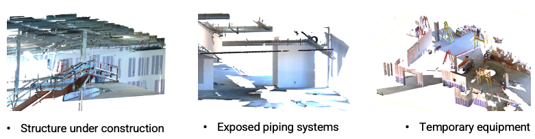

# SIP_dataset
Sites in Pieces: A SIP dataset of disaggregated 3D scans for construction-phase segmentation (formerly CnstPCIM dataset)

<p align="center">
  
  <table align="center" style="font-size:13px;">
    <tr>
      <td align="center">RGB</td>
      <td align="center">Lidar Intensity</td>
      <td align="center">Surface Normal</td>
      <td align="center">Annotation</td>
    </tr>
    <tr>
      <td></td>
      <td></td>
      <td></td>
      <td></td>
    </tr>
    <tr>
      <td></td>
      <td></td>
      <td></td>
      <td></td>
    </tr>
  </table>
  <p align="center"><em style="font-size:14px;">Sample Visualization</em></p>
</p>

- **Single-scan FARO LiDAR scenes** that retain real-world occlusion, density imbalance, and restricted visibility—conditions that multi-scan registration often removes. **Uniform-ratio sampled** to match a 0.01 m voxel-equivalent density while preserving the essential geometric characteristics of the original single scans.

- **Collected throughout construction phases**, capturing both permanent structural components and temporary construction objects integral to on-site operations.

<p align="center">
  
</p>

<!-- ## Overview

- [Instructions](#instructions)
- [Class List](#class-list)
- [Visualization](#visualization)
- [License](#license) -->


## Class Taxonomy
We organize SIP classes into three semantic groups reflecting their role on the jobsite. (Note that parentheses indicate the abbreviated labels used in annotation.)

- **A. Built Environment** – Permanent or in-progress components of the built structure.  
  - *A1. Permanent Structural Components* – wall, ceiling, floor, column, stair framing (stair), girder  
  - *A2. In-Progress Built Components* – MEP piping (pipes), opening framing (frame), window, door, awning  

- **B. Construction Operations** – Elements that support construction activities, on-site operations, and the handling or movement of equipment and materials.  
  - *B1. Works & Access Structures* – guardrails, site fence (fence), scaffolding  
  - *B2. Operational Equipment* – step ladder (ladder), scissor lift (lift)  
  - *B3. Site Logistics* – staged materials (mtrl), portajohn, office trailer (container)  

- **C. Site Surroundings** – Natural or site-context elements that are not part of the constructed facility.  
  - ground, tree, monument, vehicle


## Directory Structure
```
sip-indoor/
  │ class_config.json
  │ splits.json
  └─scans/
    │ scan.txt [xyzrgbINor] - original scan (Before annotation)
    └─Annotation/
        │ class1.txt [xyzrgbINor]
        │ class2.txt
        │ ⋮ 
        └─classN.txt

sip-outdoor/
  │ ⋮ 
  └─
```


- *class_info.json* — Defines class labels and their color codes for visualization. The `indexed` flag specifies which classes are intended for benchmarking. 

- *splits.json* — Contains dataset split info (train / test / val), adjustable via configuration flags.


### Recommended Benchmark Configuration
We provide a recommended subset of indexed classes—those most consistently represented in indoor construction scenes and suitable for stable benchmarking. The remaining classes can be optionally included as **[auxiliary/context categories]** for extended experiments.

```
Indexed (recommended for SIP-Indoor benchmarking):
0: wall, 1: ceiling, 2: floor, 3: pipes, 4: column, 5: ladder, 6: stair 
```

<!-- #### **Non-Indexed** (auxiliary / context only):  
**7: frame, 8: lift, 9: mtrl, 10:window**, 11: guardrails, 12: door, 13: ground, 14: vehicle, 15: tree, 16: fence, 17: scaffolding, 18: portajohn, 19: container, 20: monument, 21: girder, 22: awning -->


## Instructions

### Download

The full SIP dataset, including both *SIP-Indoor* and the *SIP-Outdoor* (extension/ auxiliary), is available on **Zenodo DOI**: https://doi.org/10.5281/zenodo.17667736

<!-- ```bash
wget "https://dl.dropboxusercontent.com/scl/fi/8kgdy1wiz6g1qj7oe79uh/SIP-indoor.zip?rlkey=oue0m4sruc0bkx2p2784tnbu7&st=9raoybx" -O sip-indoor.zip
unzip sip-indoor.zip && rm sip-indoor.zip
cd sip-indoor
``` -->


### Visualization

The `view_anno.py` colorizes class-wise annotations and outputs a new point cloud in *.txt* format. This file can be opened directly in 3D tools such as [CloudCompare](https://www.danielgm.net/cc/).

```bash
python view_anno.py sip-indoor/scans/[scan_id] [output_folder]
```
- [scan_id]: folder containing scan.txt and its Annotation/ directory
- [output_folder]: destination for the merged, colorized .txt file  

## Citation
Please cite our dataset paper:

```bibtex
@article{kim2025sip,
  title={Site in Pieces (SIP): A Construction-Phase LiDAR Dataset for Single-Scan Segmentation},
  author={Kim, Seongyong and Cho, Yong Kwon},
  journal={arXiv preprint arXiv:2025.xxxxx},
  year={2025}
}
```

## License

- The **dataset** is licensed under [CC BY-NC 4.0](https://creativecommons.org/licenses/by-nc/4.0/), and the accompanying **code** is licensed under the [MIT License](./LICENSE.md).  
